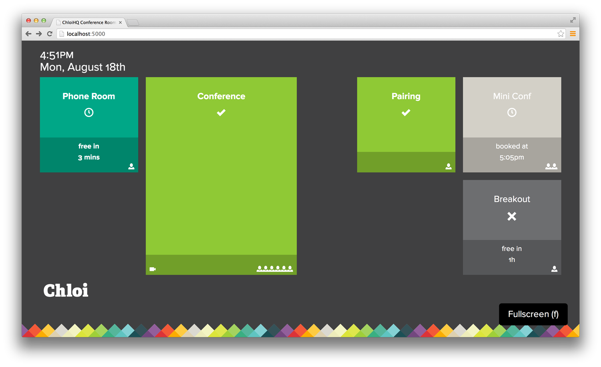

[](https://github.com/chloi/yvr-conf-free)

***

# ChloiHQ Conf Free

Visualizes conference room availability at [ChloiHQ](http://chloi.io). This is done through multiple Google Calendars and is based upon [MozillaYVR’s version](https://yvr-conf.paas.allizom.org/).

## Getting Started

```sh
# Clone the repository
https://github.com/chloi/chloihq-conf-free

# Move into the repo
cd chloihq-conf-free

# Install dependencies
npm install

# Start the server
npm start

# View the dashboard in your browser
open http://localhost:5000
```

## Endpoints and API

* Main Widget
  * http://0.0.0.0:3002/
* All Rooms and related Free / Busy information
  * http://0.0.0.0:3002/api/rooms
* Only rooms currently busy
  * http://0.0.0.0:3002/api/rooms/busy
* Only rooms currently free
  * http://0.0.0.0:3002/api/rooms/free

_**NOTE** Currently busy and free also includes a 5 min start time 'fuzz' where a room will be included if it is about to become free or busy_

## ChloiHQ Supported Conference Rooms

* Mini Conf: `bbgd0aghsl8qah1eecl3qn44js`
* Pairing: `0uqvn3kbbqhgltfajgiouj4nb0`
* Phone Room: `o2sggbafvejrl71pnjaqkofj2k`
* Conference: `v59uo85e5qvfo4jqsv4hm125ic`

### Booking Events

_Mini Conf_

```
https://www.google.com/calendar/ical/chloi.io_bbgd0aghsl8qah1eecl3qn44js%40group.calendar.google.com/public/basic.ics
```

_Pairing_

```
https://www.google.com/calendar/ical/chloi.io_0uqvn3kbbqhgltfajgiouj4nb0%40group.calendar.google.com/public/basic.ics
```

_Phone Room_

```
https://www.google.com/calendar/ical/chloi.io_o2sggbafvejrl71pnjaqkofj2k%40group.calendar.google.com/public/basic.ics
```

_Conference_

```
https://www.google.com/calendar/ical/chloi.io_v59uo85e5qvfo4jqsv4hm125ic%40group.calendar.google.com/public/basic.ics
```

Where `$EMAIL` = conf room email AND `$DATE` = moment.format("YYYYMMDD")

<!--
Deployment at Mozilla YVR
=============

*This will only apply for folks that have Mozilla LDAP accounts*

To deploy to the Mozilla PaaS, you will first need to be a member of the YVR group. If you're not, feel free to ping cturra for access.
With access (and the stackato client), run the following commands to login and join the group:

```
  stackato target api.paas.allizom.org
  stackato login <email>
  stackato group yvr
```

From this point, you can deploy normally :)
-->
